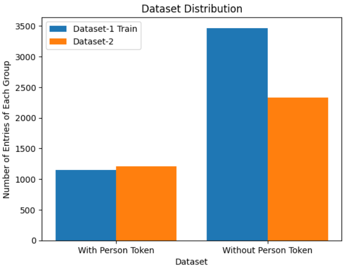
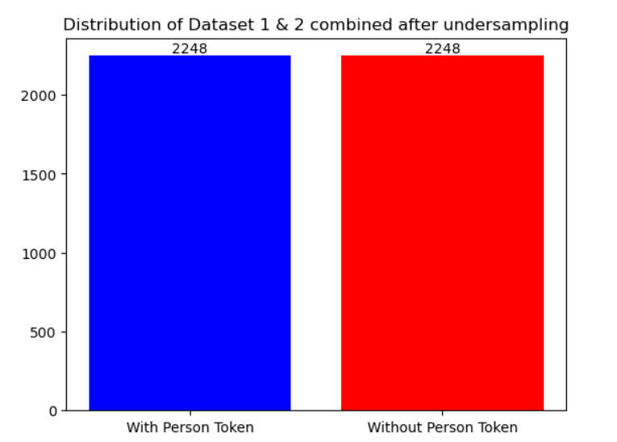

# Bengali-Person-Name-Extractor

## Table of Contents
- [Bengali Person Name Extractor](#bengali-person-name-extractor)
  - [Table of Contents](#table-of-contents)
  - [Problem Statement](#problem-statement)
  - [Solution Approach](#solution-approach)
  - [Datasets](#datasets)
  - [Preprocessing](#preprocessing)
  - [Modeling](#modeling)
  - [Post processing](#post-processing)
  - [Results](#results)
  - [Setup](#setup)
  - [Run Training](#run-training)
  - [Inference](#inference)

### Problem Statement
Building a person-name extractor for Bangla. It will take a sentence as input and output the person name present in the input sentence. The model should also be able to handle cases where no person’s name is present in the input sentence.

Example -
<br>input: আব্দুর রহিম নামের কাস্টমারকে একশ টাকা বাকি দিলাম
<br>output: আব্দুর রহিম
<br>input: অর্থনীতি ও আর্থসামাজিক বেশির ভাগ সূচকে বাংলাদেশ ছাড়িয়ে গেছে দক্ষিণ এশিয়াকে ।
<br>output: None


### Solution Approach
As this is a name entity extraction task, it was handled as `token classification task`. In token classification process we can predict which token belongs to name entity class and extract names from this prediction. For the task, first I preprocessed the given data, making appropiate datasets for token classification modeling, then experimented with different huggingface models for the task. Then I train the models with these experimented parameters and build an end-to-end inference script.The inference script will load the best saved models (saved in training processe) and do prediction using the model and then post-process the model output for desire output format for given input.

 ##### N.B: Coding is done in `python` and `pytorch` was used as ML framework.

### Datasets
For this  task two dataset were used. These are open source datasets which can be downloaded from the following links.

Dataset-1: <a href= "https://github.com/Rifat1493/Bengali-NER/tree/master/Input"> [Rifat1493/Bengali-NER] </a>
<br> Dataset-2: <a href= "https://raw.githubusercontent.com/banglakit/bengali-ner-data/master/main.jsonl"> [banglakit/bengali-ner-data] </a>

#### Dataset-1 description: 
Dataset -1 contains annotation data in `.txt` file format. From this dataset repository `train_data.txt` and `test_data.txt` files were taken for this task. These files resides in <a href= "https://github.com/Rifat1493/Bengali-NER/blob/master/Input/train_data.txt"> master/inptut/train_data.txt </a> and <a href= "https://github.com/Rifat1493/Bengali-NER/blob/master/Input/test_data.txt">master/inptut/test_data.txt </a>. <br>

`Total sentences in train.txt= 4612`<br>
`Total sentences in test.txt= 1950`

Annotation format in Dataset-1:<br>
লালপুর	B-LOC <br>
(	O <br>
নাটোর	B-LOC <br>
)	O <br>
প্রতিনিধি	O <br>
ব্রাহ্মণবাড়িয়া-২	B-LOC <br>
(	O <br>
সরাইল-আশুগঞ্জ	I-LOC <br>
)	O <br>
আসনে	O <br>
নির্বাচন	O <br>
থেকে	O <br>
সরে	O <br>
দাঁড়িয়েছেন	O <br>
আওয়ামী	B-ORG <br>
লীগের	I-ORG <br>
নেতৃত্বাধীন	O <br>
১৪-দলীয়	B-ORG <br>
জোটের	I-ORG <br>
শরিক	O <br>
জাসদের	B-ORG <br>
(	O <br>
ইনু	B-PER <br>
)	O <br>
প্রার্থী	O <br>
আবু	I-PER <br>
বকর	I-PER <br>
মো	B-PER <br>
.	I-PER <br>
ফিরোজ	I-PER <br>
।	O <br>

#### Dataset-2 description
Dataset-2 contains data in `.jsonl` file format. This dataset is arranged in one file resides in <a href="https://github.com/banglakit/bengali-ner-data/blob/master/main.jsonl">master/main.jsonl</a> <br>

`Total sentences in dataset-2 : 3545` <br>

Annotation format in dataset-2: <br>
["মো. নাহিদ হুসাইন নামের এক পরীক্ষার্থী অভিযোগ করেন, ইডেন মহিলা কলেজের পাঠাগার ভবনের দ্বিতীয় তলায় তাঁর পরীক্ষার আসন ছিল।", ["B-PERSON", "I-PERSON", "L-PERSON", "O", "O", "O", "O", "O", "O", "B-ORG", "I-ORG", "L-ORG", "O", "O", "O", "O", "O", "O", "O", "O", "O"]]


#### Dataset disribution:

<p align="center">
   
</p>


### Preprocessing

#### Dataset loading and adjusting annotation
From the previous description we have seen that the two dataset are in two different format and their annotation format is totally different. So, we need to convert these data to a common format. So we have to pre-process these data to convert these annotation to a common format. Moreover, there are some redundant annotations in the datasets like "ORG", "LOC" etc which we don't need for our task. <br>

First we converted all the input text in a common format as language model expect a common input format. Our intented format is sentence level i.e. all tokens of a sentence are combined in sentence, not tokenized like in dataset-1. For that we converted dataset-1 to out intented format. <br>

For our person name extraction task, we only need `B-PER`(Begining of the name), `I-PER`(Inside of the name), `O`(others). As we have already seen that the datasets are annotated differently and contains reduntant annotations which we don't need for our task, we converted annotations into a common format. All the changes in annotation are listed in following table.<br>
<br>

| **Previous Annotation**                                    | **New Annotation** |
|:----------------------------------------------------------:|:--------------------------------
| B-PERSON                                                   | B-PER        |
| I-PERSON                                                   | I-PER        |
| U-PERSON                                                   | B-PER        |
| L-PERSON                                                   | I-PER        |
| B-ORG, U-ORG, I-ORG, L-ORG, B-LOC, I-LOC, TIM, O           | O            |


Example:<br>
`Text`: "লালপুর ( নাটোর ) প্রতিনিধি ব্রাহ্মণবাড়িয়া-২ ( সরাইল-আশুগঞ্জ ) আসনে নির্বাচন থেকে সরে দাঁড়িয়েছেন আওয়ামী লীগের নেতৃত্বাধীন ১৪-দলীয় জোটের শরিক জাসদের ( ইনু ) প্রার্থী আবু বকর	মো . ফিরোজ ।" <br>
`new_annotation`: ["O","O", "O", "O", "O", "O", "O", "O", "O", "O", "O" ,"O","O","O", "O", "O", "O", "O", "O" ,"O","O","O" ,"B-PER","O","O" ,"B-PER", "I-PER", "B-PER" ,"I-PER","I-PER", "O"] <br>

`Text`: "মো. নাহিদ হুসাইন নামের এক পরীক্ষার্থী অভিযোগ করেন, ইডেন মহিলা কলেজের পাঠাগার ভবনের দ্বিতীয় তলায় তাঁর পরীক্ষার আসন ছিল।" <br>
`previous annotation`: ["B-PERSON", "I-PERSON", "L-PERSON", "O", "O", "O", "O", "O", "O", "B-ORG", "I-ORG", "L-ORG", "O", "O", "O", "O", "O", "O", "O", "O", "O"] <br>
`new_annotation`: ["B-PER", "I-PER", "I-PER", "O", "O", "O", "O", "O", "O", "O", "O", "O", "O", "O", "O", "O", "O", "O", "O", "O", "O"] <br>

>Functions for data-loading and pre-processing are implemented in `utils/loading_dataset.py`.
>After running this script we will have a dataframe format data for particular dataset which can be used later for training purpose.

#### Normalizing data
Before feeding bangla text input to NLP models input text must be normalized. As there some challenges in unicode system for bengali like different varients of the same character exists in Bengali unicode system. By normalizing we convert all these varients to a single unicode representation. By analysing we found that there are some mismatch in token labels if we don't normalize input sentence. There were `1019` mismatch data in dataset-1 and `172` mismatch data in dataset-2 because of unnormalized text. So, doing normalization before training is a must for our task. 

#### Exploratory Data Analysis (EDA)
After loading our data, we did some data analysis. First, we check if all the data have proper annotation, especially checked every token in the given text have corresponding annotaion. If there are missing annotation in any data, this data can't be used in training. Thus we discarded those entries with erroneous labels.

<br> We checked if there is any common entries in train and test datasets. For our test dataset we used dataset-1 testing data. After checking we found `67` common entries in train, test dataset. So we removed these common data from test dataset, because these common data may introduce data-leakage problem in our experiment.

<br> Next we check the distribution of our datasets. We checked how many input entries contains name entity. From our investigation, we found that dataset is highly imbalanced and there were small ammount of data with name entity in our datasets. The distribution of these datasets are given bellow.

<p align="center">
   
</p>


#### Downsampling and Upsampling
In classification task, if training data is very imbalanced, model will suffer from `overfitting problem`. From the distribution we found that the given datasets are imbalanced.So, first we combined both of these dataset to a single dataset for training. To tackle `overfitting` we tried downsampling on majority class and upsampling on minority class.<br>

<p align="center">
   
</p>


#### Aligning annotation labels to tokens

In language model, we convert text token to a particular number so that our model can process the data. As different model uses different tokenization scheme like word toekenizer, sub-word tokenizer etc. In sub-word tokenizer, any token may broken into multiple tokens before converting into corresponding numerical value. For that there may be incoherence in tokens labels as our tokens are word level. So we implemented a fuction which will align our old labels to new label that match the tokenized tokens.

> All these preprocessing functions will be found in `utils/data_preprocessing.py` script.

#### Train-validation split
For train-validation split, I have used `stratifiedkfold` from `sklearn`. Here I used this split method so that our train valid dataset have properly distributed samples from both class (with person token and without person token).We have done most of the experimented with 3 fold cross-validation to ensure models robustness.


### Modeling

#### Models
For modeling we choose DL based approach over feature based approach becasue of recent advancement of transformer based model performs much better than feature based models. <br>
For DL based model we have 2 choices, either to use multilingual language-models or models that were pretrained on bengali dataset. For our token classification task we choose to use bert-base model because it has a bengali pretrained version and suitable for token classification task. 

For modeling we used bert-based huggingface models. We used 4 models in our experiments. 
1. <a href= "https://huggingface.co/nafi-zaman/celloscope-28000-ner-banglabert-finetuned">ner-banglabert-finetuned
2. <a href= "https://huggingface.co/csebuetnlp/banglabert">csebuetnlp/banglabert
3. <a href= "https://huggingface.co/csebuetnlp/banglabert_large"> csebuetnlp/banglabert_large
4. <a href= "https://huggingface.co/nafi-zaman/mbert-finetuned-ner">mbert-finetuned-ner


> We build a custom model class which will load the desire model and add some final dense layers for entity classification task.

#### Loss function and metrices
For our task we use `CrossEntropyLoss` loss function for calculating our model loss. For monitoring our model performance we used `F1_score` as model metric. F1_Score was choosen as model monitoring metrics because it gives more general idea of the model even if dataset is imbalanced.

#### Optimizer and scheduler
For optimizer we used `AdamW` optimizer and for learning rate scheudler we tried three types of scheduler -`[CosineAnnealingLR, CosineAnnealingWarmRestarts, linear]`

#### Training process
We build custom `training loop` for training and validating our model performance. I have build custom training loop rather than using a trainer becasue it give more freedom to modify and experimenting with different parameter. We trained each of the model and done `3 fold cross-validation`. Performance of these models are listed in the following table. Cross-validation method was used as it gives us insights about models robustness and ensures more general model performance and no overfitting is occuring. 

### Post-processing
During inference, we needed to do some post processing to get our desired output. As our model predict class for each tokens, we have to process these outputs and extracted name token need to be converted to text format. For this we first extract the spans where a person name may occur then convert these spans to corresponding token values and the decode the tokens using `tokenizer.deocde` method. <br>

Example:<br>
Given Text: আব্দুর রহিম নামের কাস্টমারকে একশ টাকা বাকি দিলাম <br>
Extracted Names: ["আব্দুর রহিম"] <br>

### Results


| **Model**                                                                   | **F1 Score** |
|:----------------------------------------------------------:|:--------------------------------
| mbert                                                                       | 0.753          |
| bangla-bert-base                                                            | 0.732          |
| bangla-bert-ner-finetuned (only dataset-1)                                  | 0.702          |
| bangla-bert-ner-finetuned (only dataset-2)                                  | 0.695          |
| bangla-bert-ner-finetuned (combined data)                                   | 0.768          |
| bangla-bert-ner-finetuned + downsampled                                     | 0.711          |
| **bangla-bert-ner-finetuned + combined + upsampled**                        | **0.811**      |
| bangla-bert-ner-finetuned + downsampled + upsampled                         | 0.801          |
| bangla-bert-large                                                           | 0.752          |
| bangla-bert-large + downsampled                                             | 0.788          |
| bangla-bert-large + downsampled + upsampled                                 | 0.781          |

N.B: All the experimented done with combined data if not specified.

#### Result analysis: 
From the above table we can see different models performance. From the experiment we find best result for bangla-bert-ner-finetuned with upsampled dataset training. So, with larger dataset we can also get better results. We can also see that for larger model, without dataset balancing gives lower performance compare to balanced dataset [upsampled, downsampled] because they tends to suffer overfitting problem easily than lighter models.

### Running Scripts for training and Inference

#### Directory Introduction

```
Bengali_NER/
├── Datasets/
    └── dataset_1_train.txt
    └── dataset_1_test.txt
    └── dataset_2.jsonl
├── utils/
    └── configuration.py 
    └── loading_dataset.py
    └── data_preprocessing.py
    └── training_utils.py
    └── inference_utils.py
├── training.py
├── testing.py
├── inference.py
└── requirements.txt

```

* `configuration.py`: Contains all the important hyperameters and configuartion parameters like model_name, model_checkpoint etc. To train with different configuration chage values in this file or pass parameter in command line in proper format.<br>
* `loading_dataset.py`: Contains helper functions for loading files and adjusting labels in proper format.<br>
* `data_preprocessing.py`: Contains all the helper function for data pre-processing.<br>
* `training_utils.py`: Contains all the helper function for training like CustomDataset class, NER_MODEL class etc.<br>
* `inference_utils.py`: Contains all the helper function for prediction and post-processing.<br>
* `training.py`: Combines all the helping functions for training and run training.<br>
* `testing.py`: Computes model performance on test dataset and returns metrics values. <br>
* `inference.py`: End-to-End inference script. Combines all helper functions for inference and do end-to-end inference. <br>
* `requirements.txt`: All required module list.


 ### Setup

For installing the necessary requirements, use the following bash snippet

```bash
$ git clone https://github.com/VirusProton/Bengali-Person-Name-Extractor.git
$ cd Bengali-Person-Name-Extractor/
$ python3 -m venv <env_name>
$ source <env_name>/bin/activate 
$ pip install -r requirements.txt
```

N.B: Please adjust commands if you are running these other than linux terminal i.e. windows cmd or google colab.

##### Normalizer
``` bash
$ pip install git+https://github.com/csebuetnlp/normalizer
```

 ### Run Training
To see list of all available options, do `python training.py -h`. There are two ways to provide input data files to the script:

* with flag `--model_name <model_name>` where `<model_name>` refers to a valid name of a huggingface model.
* by editing 'configuration.py' scripts parameters.


#### Finetuning
For finetuning, a minimal example is as follows:<br>
[The following command snipet will run the script in debugging mode. To run full training set --debug False]

```bash
$ python training.py \
    --debug True \
    --model_name "csebuetnlp/banglabert" \
    --output_dir "./Models/" \
    --dataset_no 3 \
    --do_normalize True \
    --n_folds 2 \
    --num_epochs 3 \
    --learning_rate 2e-5 \
    --gradient_accumulation_steps 1 \
    --scheduler "linear"  \
    --train_batch_size 8 \
    --valid_batch_size 16 \
    --max_length 256 \
```

#### Downloading Trained Weights
All of the experimented weights are resides in this drive <a href="https://drive.google.com/file/d/1IHYJbYYjC1x3XWk5aQ8qdGeNYOHIM70q/view?usp=drive_link">link <a> . Please download these weights files and put them into a folder named `Models`. <br>
You can also download by running these bash commands in terminal.<br>

```bash
$ pip install gdown
$ gdown --id 1IHYJbYYjC1x3XWk5aQ8qdGeNYOHIM70q
$ unzip Models.zip
```

### Testing
This script run testing on test dataset and returns model prformance (f1_score).<br>

To see list of all available options, do `python testing.py -h`
N.B: This script is build for data format as dataset-1. Please data in proper format.  

> If you want to run test on already trained model, please run the following command for d

```bash
$ python testing.py \
    --test_data_path "<path>"
    --model_name "csebuetnlp/banglabert" \
    --model_checkpoint "./Models/best_model_0.bin" \
    --test_batch_size 16 \
    --max_length 256 \
```

N.B: To run with proper weights and proper model name please follow the following format.

| **Model**                      |    **model_name**                                        | **model_checkpoint** |
|:------------------------------:|:--------------------------------------------------------:|:--------------------------------
| bangla-bert-ner-finetuned      |"nafi-zaman/celloscope-28000-ner-banglabert-finetuned"    | "./Models/banglabert-ner-finetuned.bin"    |
| bangla-bert-base               | "csebuetnlp/banglabert"                                  | "./Models/bangla-bert-base.bin"          |
| bangla-bert-large              |"csebuetnlp/banglabert_large"                             | "./Models/bangla-bert-large.bin"          |
| mbert                          |"nafi-zaman/mbert-finetuned-ner"                          | "Models/mbert.bin"          |

 ### Inference 
This inference script runs as an end-to-end inference style that means it will take a text string or list of texts and extract names from these given inputs.<br>

To see list of all available options, do `python inference.py -h`

N.B: Please put best model weights in `Model/` directroy and edit `model_checkpoint` or pass model path (pass `absulate path`) in command line.<br>

For run end-to-end inference use following bash command snippet:

```bash
$ python inference.py \
    --text "আব্দুর রহিম নামের কাস্টমারকে একশ টাকা বাকি দিলাম"
    --model_name "csebuetnlp/banglabert" \
    --model_checkpoint "./Models/best_model_0.bin"
```

#### N.B: Please adjust certain commands if you are running these in windows or MacOS
